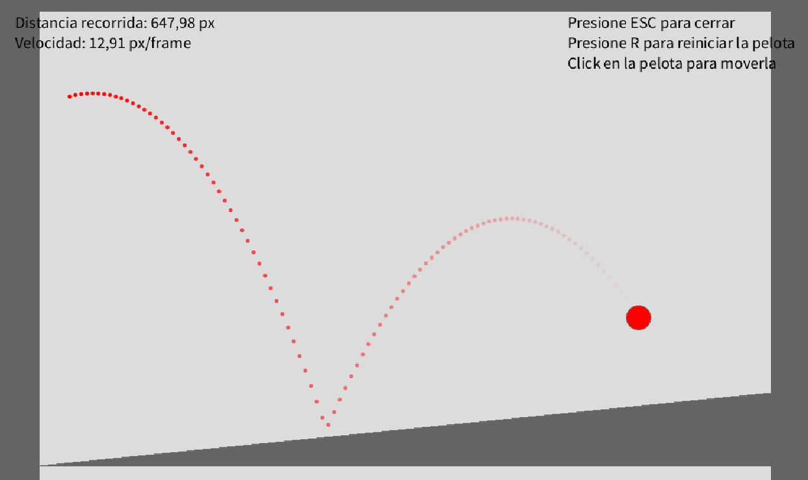

# Códigos de Simulación 2023-2 / Simulation Codes 2023-2

Este repositorio contiene una colección de códigos, scripts y proyectos desarrollados durante el aprendizaje de la materia de **Simulación** en la carrera de **Ingeniería Multimedia** (Semestre 2023-2).

*This repository contains a collection of codes, scripts, and projects developed during the **Simulation** course for the **Multimedia Engineering** degree (Semester 2023-2).*

---

## 🇪🇸 Español

### Descripción del Proyecto

El repositorio documenta el progreso y los ejercicios prácticos realizados a lo largo del semestre, abarcando desde simulaciones físicas básicas en **Processing** hasta la implementación de mecánicas de juego y sistemas de partículas en **Unity**.

### Estructura del Contenido

El trabajo se divide en tres cortes principales:

* **Corte 1: Fundamentos de Física y Processing**
  * Simulaciones de caída libre, movimiento parabólico y osciladores (resortes).
  * Minijuegos en Processing (e.g., "Atrápame si puedes").
  * Introducción a sistemas de partículas en Unity.
* **Corte 2: Físicas Avanzadas y Prototipado en Unity**
  * Colisiones elásticas e inelásticas (choques de bolas, paredes inclinadas).
  * Desarrollo de mecánicas de juego en Unity: movimiento de personajes, salto, empuje de objetos y plataformas móviles.
* **Corte 3: Proyecto Final**
  * Integración de mapas, menús (pausa, inicio) y mecánicas completas en Unity.
  * Entrega final del videojuego.

### Galería y Muestras

#### Simulaciones en Processing

### Autor y Contacto

**David Pinto Gómez**

* 💼 **LinkedIn:** [Ver Perfil](https://www.linkedin.com/in/pinto-gomez-david/)
* 💻 **GitHub:** [@pintomultimedia2002](https://github.com/pintomultimedia2002)

---

## 🇺🇸 English

### Project Description

This repository documents the progress and practical exercises carried out throughout the semester, ranging from basic physics simulations in **Processing** to the implementation of game mechanics and particle systems in **Unity**.

### Content Structure

The work is divided into three main terms ("Cortes"):

* **Term 1: Physics Fundamentals & Processing**
  * Simulations of free fall, projectile motion, and oscillators (springs).
  * Mini-games in Processing (e.g., "Catch me if you can").
  * Introduction to particle systems in Unity.
* **Term 2: Advanced Physics & Unity Prototyping**
  * Elastic and inelastic collisions (ball collisions, inclined walls).
  * Game mechanics development in Unity: character movement, jumping, pushing objects, and moving platforms.
* **Term 3: Final Project**
  * Integration of maps, menus (pause, start), and complete mechanics in Unity.
  * Final video game submission.

### Gallery & Showcases

#### Processing Simulations

### Author & Contact

**David Pinto Gómez**

* 💼 **LinkedIn:** [View Profile](https://www.linkedin.com/in/pinto-gomez-david/)
* 💻 **GitHub:** [@pintomultimedia2002](https://github.com/pintomultimedia2002)
